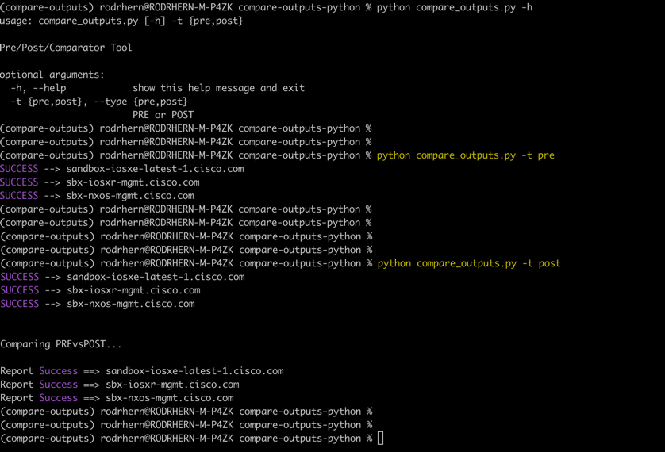
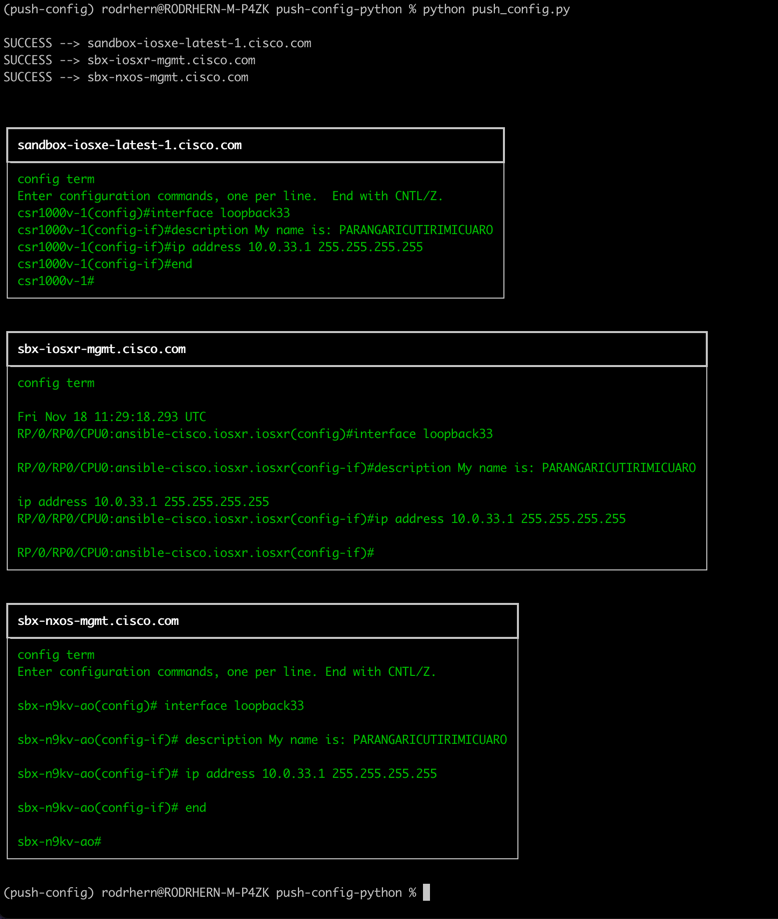
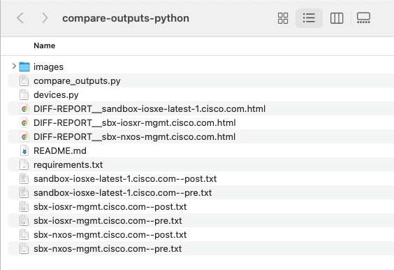
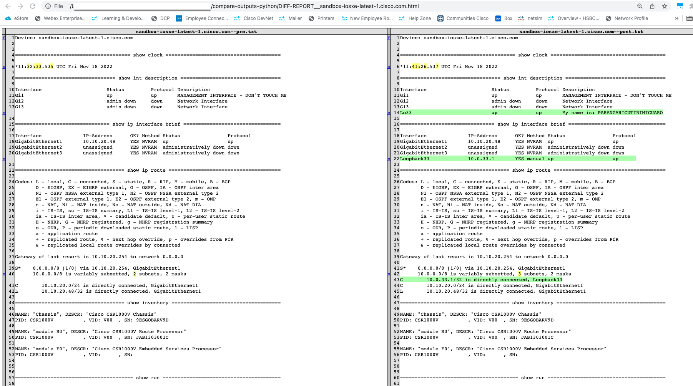

# Compare PRE/POST Outputs & Get DIFF HTML Report
Highlight the differences between 2 outputs files (PRE - POST)


## Pre-Requisites
You must have **Python3** and **pip3** installed. 
Once is done, clone this repository


## Install python dependencies
1. Open a CMD/Powershell/terminal console and move it folder `compare-outputs-python``
2. Install the python dependencias that are in _requirements.txt_ file. You can use:

```
pip intall -r requirements.txt
````

## Running the script
1. Use the next command to run the script:
```
# Run Prechecks
python compare_outputs.py -t pre

# Run Postchecks and DIFF Report
python compare_outputs.py -t post
```

### A) Execution


### B) Pushing some config


### C) Files outputs [txt, PRE, POST & HTML Reports]


### D) HTML Comparation Report



## Do you need help?
For any help send my an [email](mailto:rod.hpadilla@gmail.com)
